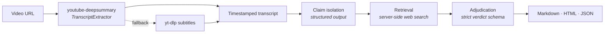

<div align="center">

# deepcheck

**A verification pipeline for spoken claims.**
Transcribe a video, isolate every checkable assertion, and adjudicate each one against the live public record.

[](https://python.org)
[](https://docs.claude.com)
[](#development)
[](#installation)
[](LICENSE)

</div>

---

## The problem

Assertions are produced faster than they can be checked. A single hour of political speech, a quarterly earnings call, a press briefing, a deposition — each carries dozens of specific, falsifiable statements, and each is consumed in full long before any of them are examined. The asymmetry is structural: making a claim costs a sentence, and checking one costs a research session. Newsrooms have understood this for a century and staffed against it. Almost nobody else can.

deepcheck closes part of that gap by treating a recording as a body of evidence rather than a stream of talk. It converts speech to text, decomposes the text into discrete factual assertions, retrieves supporting and contradicting material for each assertion independently, and emits an auditable record in which every judgment is bound to the sources that produced it. The output is not a verdict you are asked to trust. It is a worksheet you are expected to check — every finding ships with the articles behind it, cover image and headline intact, so the reader can go to the source in one click.

The transcription layer is not ours. deepcheck runs on top of [**youtube-deepsummary**](https://github.com/nickita-khylkouski/youtube-deepsummary) by [@nickita-khylkouski](https://github.com/nickita-khylkouski), importing its `TranscriptExtractor` directly rather than reimplementing extraction. What this project adds is everything downstream of the transcript.

---

## How it works



**Acquisition.** The transcript comes from upstream's extractor, which negotiates YouTube's caption tracks and language fallbacks. If that path fails for any reason, deepcheck falls back to `yt-dlp` subtitles and records which route produced the text, because provenance starts at ingestion and a report that cannot say where its transcript came from is not auditable.

**Isolation.** The transcript is chunked and each chunk is decomposed into standalone assertions. This step does more work than it appears to. A claim as spoken is rarely checkable as spoken — it leans on pronouns, on "last year", on whatever was said two sentences ago. Each extracted claim is rewritten to survive on its own, with references resolved, while the speaker's numbers are preserved exactly as uttered. Every claim retains a verbatim quote, which is matched back against the segment list to anchor it to a timestamp in the recording. Opinions, jokes, and pure predictions are deliberately excluded; a pipeline that adjudicates rhetoric produces noise.

**Retrieval.** Each claim is researched independently against the live web using Claude's server-side search. The instruction is adversarial by design: find the evidence *against* the claim, not only the evidence for it. Primary sources — agency data, filings, transcripts, official statements — are weighted above aggregators, and disagreement between sources is recorded rather than resolved away.

**Adjudication.** A second, separate call converts that research into a verdict under a strict schema, with no tools attached. The separation is partly a technical constraint — search results carry citations, and citations cannot be combined with constrained output in a single request — but it is also the more defensible design. The verdict is written from evidence already on the page rather than from the model's recollection, which for any event after the training cutoff is the difference between a check and a guess.

Verdicts fall into six classes. `true` and `mostly_true` cover claims that hold, the latter allowing minor imprecision that does not change the meaning. `false` covers claims the evidence contradicts. `unverifiable` is used where no adequate public evidence exists in either direction, and is preferred over guessing. `opinion` marks statements that were never factual assertions to begin with.

The sixth class, `misleading`, is the one that earns its keep. Most contested numbers in public life are directionally correct and materially wrong — a real trend cited at an impossible magnitude, a genuine figure stripped of the context that gives it meaning. "Crime fell 88%" when it fell 40% is neither true nor false in any useful sense, and a binary scale is forced to call it one or the other. A verification system without this category will systematically launder exaggeration into accuracy.

Verdicts are generated by a model and carry a confidence level describing the strength of the evidence, not the strength of the model's conviction. Each one is published with the sources that produced it, and the sources are the point.

---

## Example report

The example is a real run against C-SPAN's recording of President Trump's remarks at the **White House Correspondents' Dinner on July 24, 2026** — the rescheduled dinner, held after a shooting outside the Washington Hilton cut the original April 25 event short. He spoke for 65 minutes, covering the Iran strikes, DC crime, TikTok, the White House ballroom, and a long stretch of political material. deepcheck pulled 11,531 words of transcript, isolated the checkable claims, and adjudicated each against the live web: **20 documented claims** across **31 published sources**, every source card carrying the article's own cover and headline.

**[Download the report — PDF, 16 pages](examples/trump-whcd-factcheck.pdf)**

---

## Using it

```bash
# transcript only — no API calls, no cost
deepcheck transcribe "https://www.youtube.com/watch?v=VIDEO_ID" -o transcript.txt

# full verification pass, all three output formats
deepcheck check "https://www.youtube.com/watch?v=VIDEO_ID" -f md,html,json -o report

# `check` is the default
deepcheck "https://www.youtube.com/watch?v=VIDEO_ID"
```

Three artifacts come out of a run. Markdown is for reading and diffing. JSON is the machine-readable record — every claim, verdict, confidence level, and source URL, suitable for loading into whatever sits downstream. HTML is the presentation layer: a single self-contained file with every article cover embedded as a data URI, so it opens offline with no external requests and can be archived as-is.

| Flag | Default | Purpose |
| --- | --- | --- |
| `-o, --out` | `report` | Output path, without extension |
| `-f, --format` | `md` | Any of `md`, `html`, `json`, comma-separated |
| `--max-claims` | `40` | Cap on claims verified. `0` disables the cap |
| `--concurrency` | `4` | Parallel verifications |
| `--max-searches` | `6` | Web searches allowed per claim |
| `--effort` | `high` | `low` … `max`; reasoning depth |
| `--model` | `claude-opus-5` | Model override |
| `--no-fallbacks` | off | Disable the server-side refusal fallback |

Every flag has a `DEEPCHECK_*` environment equivalent — see [`.env.example`](.env.example). Cost scales with the number of claims rather than the length of the video: one call per transcript chunk to isolate claims, then two per claim to research and adjudicate.

---

## Architecture

**Two acquisition paths.** Upstream is primary and `yt-dlp` is the fallback, with the report recording which one ran. During development the fallback earned its place more than once, which is the argument for having it.

**A compatibility shim for upstream.** `youtube-deepsummary` calls `YouTubeTranscriptApi.get_transcript()` and `.list_transcripts()` — classmethods that `youtube-transcript-api` removed in 1.2. Upstream pins `==1.1.0`, which will not install on every Python version, and the last release that retained the classmethods no longer works against YouTube's current endpoints. Rather than fork upstream or freeze the interpreter, [`deepcheck/compat.py`](deepcheck/compat.py) re-attaches the two classmethods on top of the modern library, so upstream's extractor runs unmodified. It is a no-op when the methods already exist.

**Timestamp anchoring.** Each claim carries a verbatim quote matched back to a transcript segment: exact substring first, then fuzzy match above a similarity floor. Speech recognition output and the model's quoting rarely agree character for character, and a claim that cannot be located in the recording cannot be independently reviewed.

**Failure isolation.** Per-claim errors and model refusals are caught and recorded as `unverifiable` with the reason attached. One claim that cannot be checked does not take down the run, and the report says so rather than silently dropping it.

```
deepcheck/
├── transcript.py   upstream integration + yt-dlp fallback
├── compat.py       shim for youtube-transcript-api 1.2+
├── claims.py       chunking, isolation, timestamp anchoring
├── verify.py       retrieval → adjudication
├── report.py       Markdown / HTML / JSON renderers
├── llm.py          pause_turn, refusals, JSON extraction
└── cli.py          argument routing, error messaging
```

---

## Installation

The quickstart scripts build the environment, vendor the transcriber, verify credentials, and open a coding agent inside the repository.

| | macOS / Linux | Windows (PowerShell) |
| --- | --- | --- |
| **Claude Code** | `./scripts/quickstart-claude.sh` | `.\scripts\quickstart-claude.ps1` |
| **Codex** | `./scripts/quickstart-codex.sh` | `.\scripts\quickstart-codex.ps1` |

```
deepcheck quickstart — Claude Code

1/4  Python environment
  ✓ Python 3.12.4
  ✓ created .venv
2/4  Dependencies
  ✓ deepcheck installed (editable)
3/4  Upstream transcriber
  ✓ cloned youtube-deepsummary
  ✓ transcript backend ready
4/4  Credentials
  ✓ ANTHROPIC_API_KEY is set

Opening claude in ~/deepcheck
```

If the agent is not installed, setup still completes and the script reports the install command.

To install by hand instead:

```bash
git clone https://github.com/jaytrivediSF25/deepcheck.git
cd deepcheck
pip install -e .

./scripts/install_upstream.sh          # macOS / Linux
.\scripts\install_upstream.ps1         # Windows
```

Credentials resolve in the SDK's own order — `ANTHROPIC_API_KEY`, then `ANTHROPIC_AUTH_TOKEN`, then an `ant auth login` profile. Any one is sufficient. Transcription requires none of them.

---

## Development

```bash
pip install -e ".[dev]"
pytest
```

Fifty-nine tests, no network required. They cover URL parsing, VTT parsing and rolling-window collapse, chunking, timestamp anchoring, claim prioritization, the compatibility shim, report rendering in all three formats, HTML escaping, CLI argument routing, and API error messaging.

---

## Licence

MIT — see [LICENSE](LICENSE). `youtube-deepsummary` is a separate project under its own licence; this repository vendors it at install time rather than redistributing it.
