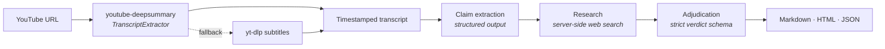

<div align="center">

# 🔎 deepcheck

**Transcribe a YouTube video. Pull out every checkable claim. Verify each one against the live web.**

[](https://python.org)
[](https://docs.claude.com)
[](#development)
[](#quickstart)
[](LICENSE)

Built on top of **[youtube-deepsummary](https://github.com/nickita-khylkouski/youtube-deepsummary)** by [@nickita-khylkouski](https://github.com/nickita-khylkouski) — deepcheck imports its `TranscriptExtractor` directly instead of reimplementing extraction. The verification layer is this project.

</div>

---

## ⚡ Quickstart

One command. It builds the environment, vendors the transcriber, checks your credentials, and drops you into a coding agent inside the repo.

<table>
<tr>
<th width="50%">🤖 Claude Code</th>
<th width="50%">🧠 Codex</th>
</tr>
<tr>
<td>

**macOS / Linux**
```bash
./scripts/quickstart-claude.sh
```

**Windows (PowerShell)**
```powershell
.\scripts\quickstart-claude.ps1
```

</td>
<td>

**macOS / Linux**
```bash
./scripts/quickstart-codex.sh
```

**Windows (PowerShell)**
```powershell
.\scripts\quickstart-codex.ps1
```

</td>
</tr>
</table>

```
deepcheck quickstart — Claude Code

1/4  Python environment
  ✓ Python 3.12.4
  ✓ created .venv
2/4  Dependencies
  ✓ deepcheck installed (editable)
3/4  Upstream transcriber
  ✓ cloned youtube-deepsummary
  ✓ transcript backend ready
4/4  Credentials
  ✓ ANTHROPIC_API_KEY is set

Opening claude in ~/deepcheck
```

> If the agent isn't installed yet, setup still completes and the script tells you the install command. Rerun it afterwards.

<details>
<summary><b>Manual install</b> (no agent, no venv magic)</summary>

```bash
git clone https://github.com/jaytrivediSF25/deepcheck.git
cd deepcheck
pip install -e .

./scripts/install_upstream.sh          # macOS / Linux
.\scripts\install_upstream.ps1         # Windows
```

Then set a credential. The SDK resolves `ANTHROPIC_API_KEY`, then `ANTHROPIC_AUTH_TOKEN`, then an `ant auth login` profile — any one works.

</details>

---

## 🧭 How it works



| Stage | What happens | API calls |
| --- | --- | --- |
| **Transcribe** | Upstream's extractor, with a yt-dlp fallback | 0 |
| **Extract** | Transcript is chunked; each chunk yields self-contained claims anchored to timestamps | 1 per chunk |
| **Research** | Claude searches the web, told to look for evidence *against* the claim too | 1 per claim |
| **Adjudicate** | Research becomes a verdict under a strict schema, no tools attached | 1 per claim |

---

## 🚀 Usage

```bash
# transcript only — no API calls, no cost
deepcheck transcribe "https://www.youtube.com/watch?v=VIDEO_ID" -o transcript.txt

# full fact-check, all three output formats
deepcheck check "https://www.youtube.com/watch?v=VIDEO_ID" -f md,html,json -o report

# `check` is the default
deepcheck "https://www.youtube.com/watch?v=VIDEO_ID"
```

### Example run

```
Fetching transcript...
  11,431 words via youtube-deepsummary — President Trump Full Remarks...
Extracting claims...
  chunk 1/6 … chunk 6/6
  38 claims to verify
Verifying (concurrency 4)...
  38/38

Checked 38 claims:
  False                     12
  Misleading                 7
  Mostly true                4
  True                       9
  Unverifiable               6

Wrote report.md
Wrote report.html
```

### Flags

| Flag | Default | Purpose |
| --- | --- | --- |
| `-o, --out` | `report` | Output path, without extension |
| `-f, --format` | `md` | Any of `md`, `html`, `json`, comma-separated |
| `--max-claims` | `40` | Cap on claims verified. `0` disables the cap |
| `--concurrency` | `4` | Parallel verifications |
| `--max-searches` | `6` | Web searches allowed per claim |
| `--effort` | `high` | `low` … `max`; reasoning depth |
| `--model` | `claude-opus-5` | Model override |
| `--no-fallbacks` | off | Disable the server-side refusal fallback |

Every flag has a `DEEPCHECK_*` environment equivalent — see [`.env.example`](.env.example).

---

## ⚖️ Verdicts

| Rating | Meaning |
| --- | --- |
| 🟢 `true` | Accurate as stated |
| 🟢 `mostly_true` | Accurate in substance; minor imprecision |
| 🟡 `misleading` | Real facts arranged to mislead, **or directionally right but wrong on magnitude** |
| 🔴 `false` | Contradicted by the evidence |
| ⚪ `unverifiable` | No adequate public evidence either way |
| ⚪ `opinion` | A value judgment, not a factual assertion |

`misleading` is the one that earns its keep. Most political numbers are directionally right and materially wrong — "crime fell 88%" when it fell 40% is not "mostly true", and a binary scale would have to call it one or the other.

---

## 🔬 Why two calls per claim

Search results carry citations, and citations **cannot** be combined with `output_config.format` in a single request. So research runs unconstrained with the `web_search` tool, and a second call turns that research into the verdict schema with no tools attached.

The split has a second benefit: the verdict is written from evidence sitting on the page rather than from the model's recollection. For anything after the training cutoff, that is the difference between a check and a guess.

---

## 🛠 Design notes

**Two transcript paths.** Upstream is primary; `yt-dlp` subtitles are the fallback, and the report records which one produced the transcript. During development the fallback earned its place more than once.

**A compatibility shim for upstream.** `youtube-deepsummary` calls `YouTubeTranscriptApi.get_transcript()` and `.list_transcripts()` — classmethods that `youtube-transcript-api` 1.2 removed. Upstream pins `==1.1.0`, which will not install on every Python version, and the last release that kept the classmethods (0.6.2) no longer works against YouTube's current endpoints. [`deepcheck/compat.py`](deepcheck/compat.py) re-attaches the two classmethods on top of the modern library, so upstream's extractor runs unmodified. No fork, no pinned interpreter, and a no-op when the methods already exist.

**Claims are anchored to timestamps.** Each claim carries a verbatim quote that is matched back to a transcript segment — exact substring first, then fuzzy match above a similarity floor, because ASR output and the model's quoting rarely agree character-for-character.

**One bad claim cannot kill a run.** Per-claim failures and model refusals are caught and recorded as `unverifiable` with the reason attached.

---

## ⚠️ Limits, stated plainly

- **Verdicts are model-generated.** A research aid, not a citation. Every finding ships with its sources — follow them before relying on any single one.
- **Automatic captions are lossy.** Proper nouns get garbled and numbers occasionally do too. The extraction prompt compensates for names but cannot recover what the recognizer dropped.
- **Search coverage is uneven.** Recent, well-covered events verify well. Obscure or paywalled material returns `unverifiable` more often than it should.
- **Cost scales with claims**, not video length.

---

## 🧪 Development

```bash
pip install -e ".[dev]"
pytest
```

```
59 passed in 0.7s
```

Covers URL parsing, VTT parsing and rolling-window collapse, chunking, timestamp anchoring, claim prioritization, the compat shim, report rendering in all three formats, HTML escaping, CLI argument routing, and API error messaging. **No network required.**

```
deepcheck/
├── transcript.py   upstream integration + yt-dlp fallback
├── compat.py       shim for youtube-transcript-api 1.2+
├── claims.py       chunking, extraction, timestamp anchoring
├── verify.py       research → adjudication
├── report.py       Markdown / HTML / JSON renderers
├── llm.py          pause_turn, refusals, JSON extraction
└── cli.py          argument routing, error messaging
```

---

## 📄 Licence

MIT — see [LICENSE](LICENSE). `youtube-deepsummary` is a separate project under its own licence; this repository vendors it at install time rather than redistributing it.
