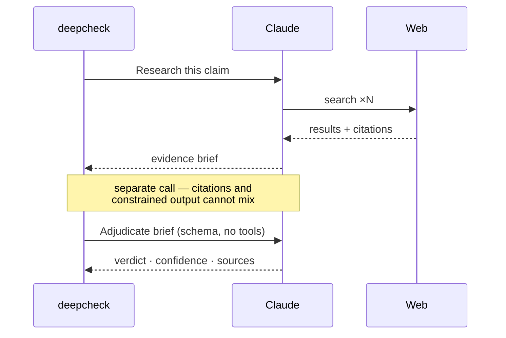
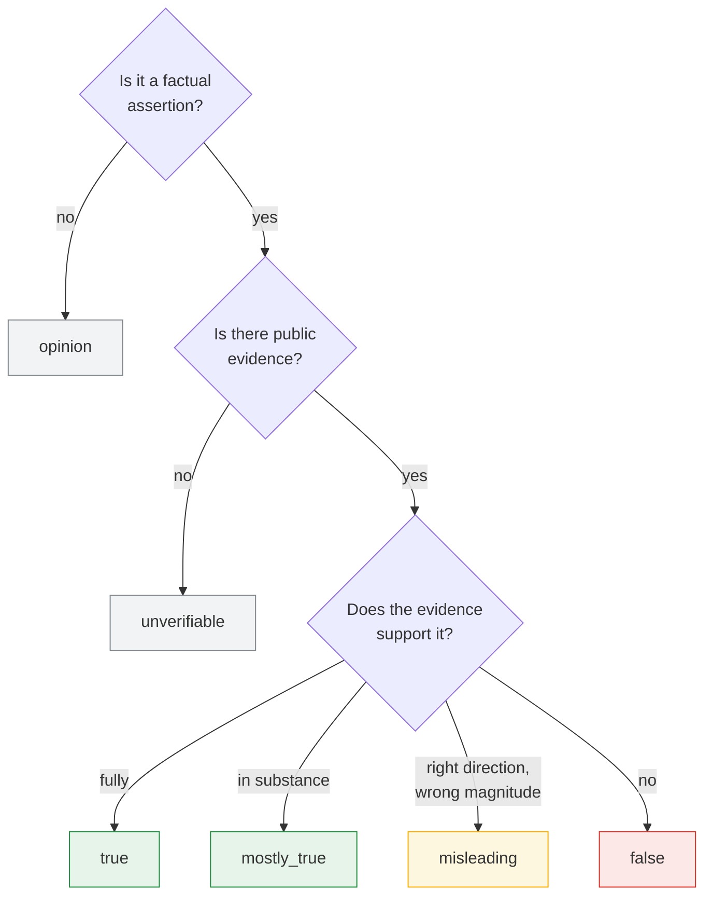
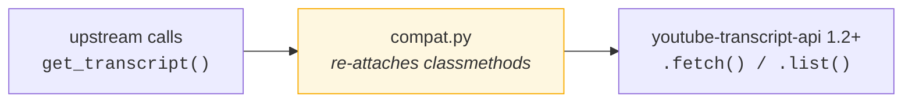

<div align="center">

# deepcheck

**A verification pipeline for spoken claims.**
Transcribe a video, isolate every checkable assertion, adjudicate each against the live public record.

[](https://python.org)
[](https://docs.claude.com)
[](#development)
[](#installation)
[](LICENSE)

</div>

---

## The problem

Making a claim costs a sentence. Checking one costs a research session. An hour of political speech carries dozens of specific, falsifiable statements and is consumed in full long before any of them are examined.

deepcheck treats a recording as evidence rather than talk. Every judgment is bound to the sources that produced it — the output is not a verdict you are asked to trust, it is a worksheet you are expected to check.

```
  1 hour of speech  ──►  11,531 words  ──►  20 checkable claims  ──►  31 sources
      65 minutes           transcript          isolated & anchored      retrieved & cited
```

Transcription is not ours: deepcheck runs on [**youtube-deepsummary**](https://github.com/nickita-khylkouski/youtube-deepsummary) by [@nickita-khylkouski](https://github.com/nickita-khylkouski), importing its `TranscriptExtractor` directly. This project is everything downstream of the transcript.

---

## Pipeline


| Stage | What it does | Why it matters |
| --- | --- | --- |
| **Acquire** | Upstream extractor, `yt-dlp` fallback | Provenance starts at ingestion — the report records which route ran |
| **Isolate** | Decompose into standalone assertions | A claim as spoken leans on pronouns and "last year"; rewritten to survive alone |
| **Anchor** | Match each verbatim quote to a segment | A claim you cannot locate in the recording cannot be reviewed |
| **Retrieve** | Adversarial web search per claim | Instructed to find evidence *against*, not only for |
| **Adjudicate** | Strict schema, no tools | Written from evidence on the page, not from recollection |

### Why two calls per claim



Partly a technical constraint, partly the more defensible design: the verdict is written from evidence already retrieved rather than from the model's recollection. For any event after the training cutoff, that is the difference between a check and a guess.

---

## Verdicts



`misleading` is the class that earns its keep. Most contested numbers in public life are directionally correct and materially wrong. **"Crime fell 88%" when it fell 40%** is neither true nor false in any useful sense — and a binary scale is forced to pick one, systematically laundering exaggeration into accuracy.

Verdicts are model-generated, carry a confidence level describing the strength of the evidence, and are published with the sources that produced them. The sources are the point.

---

## Example report

C-SPAN's recording of President Trump's remarks at the **White House Correspondents' Dinner, July 24 2026** — the rescheduled dinner, held after a shooting outside the Washington Hilton cut the original April 25 event short. Sixty-five minutes covering the Iran strikes, DC crime, TikTok, the ballroom, and a long stretch of political material.

<div align="center">

| Transcript | Claims documented | Sources cited | Report |
| :---: | :---: | :---: | :---: |
| **11,531** words | **20** | **31** | 16 pages |

**[📥 Download the report — PDF](examples/trump-whcd-factcheck.pdf)**

</div>

---

## Using it

```bash
# transcript only — no API calls, no cost
deepcheck transcribe "https://www.youtube.com/watch?v=VIDEO_ID" -o transcript.txt

# full verification pass
deepcheck check "https://www.youtube.com/watch?v=VIDEO_ID" -f md,html,json -o report

# `check` is the default
deepcheck "https://www.youtube.com/watch?v=VIDEO_ID"
```

Three artifacts per run:

```
report.md     reading and diffing
report.json   machine-readable — claim, verdict, confidence, source URLs
report.html   single self-contained file; covers embedded as data URIs,
              opens offline, archivable as-is
```

| Flag | Default | Purpose |
| --- | --- | --- |
| `-o, --out` | `report` | Output path, without extension |
| `-f, --format` | `md` | Any of `md`, `html`, `json`, comma-separated |
| `--max-claims` | `40` | Cap on claims verified. `0` disables the cap |
| `--concurrency` | `4` | Parallel verifications |
| `--max-searches` | `6` | Web searches allowed per claim |
| `--effort` | `high` | `low` … `max`; reasoning depth |
| `--model` | `claude-opus-5` | Model override |
| `--no-fallbacks` | off | Disable the server-side refusal fallback |

Every flag has a `DEEPCHECK_*` environment equivalent — see [`.env.example`](.env.example). Cost scales with claims, not video length: one call per transcript chunk, then two per claim.

---

## Architecture

```
deepcheck/
├── transcript.py   upstream integration + yt-dlp fallback
├── compat.py       shim for youtube-transcript-api 1.2+
├── claims.py       chunking, isolation, timestamp anchoring
├── verify.py       retrieval → adjudication
├── report.py       Markdown / HTML / JSON renderers
├── llm.py          pause_turn, refusals, JSON extraction
└── cli.py          argument routing, error messaging
```

**A compatibility shim for upstream.** `youtube-deepsummary` calls `YouTubeTranscriptApi.get_transcript()` and `.list_transcripts()` — classmethods that `youtube-transcript-api` removed in 1.2. Upstream pins `==1.1.0`, which will not install on every Python version, and the last release retaining the classmethods no longer works against YouTube's current endpoints.



No fork, no frozen interpreter, and a no-op when the methods already exist.

**Failure isolation.** Per-claim errors and refusals are recorded as `unverifiable` with the reason attached. One uncheckable claim does not take down the run, and the report says so rather than silently dropping it.

---

## Installation

The quickstart builds the environment, vendors the transcriber, verifies credentials, and opens a coding agent in the repository.

| | macOS / Linux | Windows (PowerShell) |
| --- | --- | --- |
| **Claude Code** | `./scripts/quickstart-claude.sh` | `.\scripts\quickstart-claude.ps1` |
| **Codex** | `./scripts/quickstart-codex.sh` | `.\scripts\quickstart-codex.ps1` |

```
deepcheck quickstart — Claude Code

1/4  Python environment
  ✓ Python 3.12.4
  ✓ created .venv
2/4  Dependencies
  ✓ deepcheck installed (editable)
3/4  Upstream transcriber
  ✓ cloned youtube-deepsummary
  ✓ transcript backend ready
4/4  Credentials
  ✓ ANTHROPIC_API_KEY is set

Opening claude in ~/deepcheck
```

<details>
<summary><b>Manual install</b></summary>

```bash
git clone https://github.com/jaytrivediSF25/deepcheck.git
cd deepcheck
pip install -e .

./scripts/install_upstream.sh          # macOS / Linux
.\scripts\install_upstream.ps1         # Windows
```

</details>

Credentials resolve in the SDK's own order — `ANTHROPIC_API_KEY`, then `ANTHROPIC_AUTH_TOKEN`, then an `ant auth login` profile. Transcription requires none of them.

---

## Development

```bash
pip install -e ".[dev]"
pytest        # 59 passed — no network required
```

URL parsing · VTT parsing and rolling-window collapse · chunking · timestamp anchoring · claim prioritization · the compatibility shim · report rendering in all three formats · HTML escaping · CLI argument routing · API error messaging.

---

## Licence

MIT — see [LICENSE](LICENSE). `youtube-deepsummary` is a separate project under its own licence; vendored at install time rather than redistributed.
